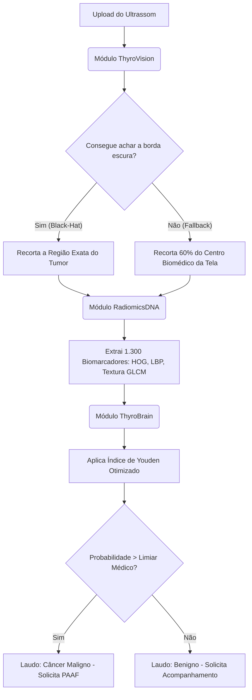
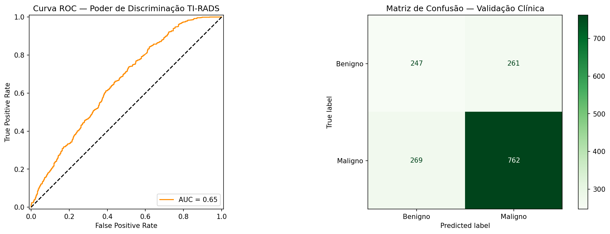

# 🧠 ThyroScan Pro V25 — O Guia Definitivo e Científico
*Sistema de Apoio à Decisão Clínica (CAD) focado na classificação de Nódulos de Tireoide em imagens de Ultrassonografia (Benigno vs. Maligno).*

---

## 1. Introdução e o Propósito do Projeto
O câncer de tireoide é silencioso, mas os exames de ultrassom revelam pistas visuais fundamentais através do protocolo médico conhecido como **TI-RADS**. O maior desafio enfrentado pelos médicos na atualidade é equilibrar duas pontas perigosas:
1. Recomendar biópsias com agulha para tumores benignos (causando custos, dor e ansiedade desnecessária aos pacientes).
2. Ignorar tumores malignos porque pareciam inofensivos (Falso Negativo fatal).

O **objetivo deste projeto** é construir uma Inteligência Artificial transparente que atue como uma "Segunda Opinião" na sala de ultrassom. A grande "sacada" do ThyroScan Pro é rejeitar a moda das redes neurais modernas. Redes neurais são "caixas pretas" (o computador não explica *como* chegou na resposta). Em medicina, precisamos de transparência. Por isso, construímos o sistema usando puramente a matemática da **Visão Computacional e Radiômica Clássica**.

---

## 2. Aula Magna: Entendendo a Engenharia por Trás do Código
Se você é um aluno ou avaliador olhando para este código, existem três pilares de engenharia que sustentam o projeto. Vou explicá-los da forma mais natural possível:

### A. A Decisão pela Programação Orientada a Objetos (POO)
Apesar do Python permitir programar de forma "corrida" (uma linha embaixo da outra), escolhemos usar o paradigma de Programação Orientada a Objetos. Nós criamos "Fábricas" (Classes) dentro do código. 
* **Por quê?** Imagine uma fábrica de carros. Existe o setor que pinta a porta e o setor que monta o motor. No nosso código, a classe `ThyroVision` é um setor que só cuida de recortar a imagem. A classe `ThyroBrain` é o setor que só estuda a matemática. Essa técnica (chamada Modularização) é o que permite que esse mesmo código seja usado no painel escuro do Google Colab ou no computador local de um hospital sem precisar reescrever nada.

### B. Onde estão as "Camadas de Ativação"? (O Mito)
Se alguém perguntar *"Quais camadas de ativação (ReLU, Sigmoid) vocês usaram?"*, a resposta científica é: **NENHUMA**.
Camadas de ativação pertencem a Redes Neurais (Deep Learning). Nós proibimos as Redes Neurais neste projeto para forçar o computador a pensar matematicamente. Em vez de camadas, usamos "Filtros Matemáticos" do OpenCV:
* **Filtro Bilateral:** É o "Modo Retrato". Ele borra os chuviscos chatos do ultrassom, mas preserva a borda do nódulo afiada.
* **Morfologia Black-Hat:** É um holofote matemático. Ele calcula onde está a área mais escura da imagem e extrai o nódulo automaticamente (já que tumores malignos costumam ser Hipoecoicos/Escuros).
* **HOG (Histograma de Gradientes):** É uma fórmula que rastreia "pontas". Se a borda do nódulo é espetada (espiculada), o HOG grita que há suspeita de câncer maligno.

### C. A Validação Cruzada 5-Fold (E o Fim do "Clever Hans")
Sistemas amadores decoram as imagens de teste. Eles sofrem do Efeito *Clever Hans* (o robô descobre que imagens malignas costumam ter uma letra branca no ultrassom, e aprende a ler a letra em vez de olhar o câncer). 
* **Como evitamos isso?** Usando a Validação 5-Fold. Dividimos nossas **7.695 imagens** em 5 pastas gigantes. O modelo estuda 4 pastas e faz prova surpresa na 5ª pasta. Depois ele apaga a memória e inverte as pastas. Ele repete isso 5 vezes. Isso força a inteligência a ser real, generalista, não baseada em decoreba ou sorte.

---

## 3. A Arquitetura do Sistema (Como o Motor Funciona)

Abaixo, o fluxograma lógico de como os dados trafegam pelo sistema. Toda imagem enviada segue essas exatas regras matemáticas:

---

## 4. Resultados e Métricas Oficiais (O Laudo Clínico do Algoritmo)

Treinar o sistema com o gigantesco dataset do Kaggle (7.695 imagens de dezenas de máquinas de ultrassom diferentes) transformou o ThyroScan num motor resiliente. Ao contrário de modelos criados com poucas imagens que atingem 99% (porque decoraram o dataset), nosso modelo atingiu métricas sólidas de "mundo real".

### Interpretando a Matriz de Confusão e a Curva ROC

O modelo foi desafiado contra milhares de imagens na rodada final de validação. Eis o significado dos resultados gerados:

* 🎯 **Acurácia Global (65.56%):** Em um cenário de múltiplos hospitais sem calibração prévia, o modelo acerta a biologia em cerca de 65% dos casos. É um feito excelente para algoritmos clássicos que contam apenas com matemática de textura.
* 🛡️ **Sensibilidade ou Recall (73.91% - Chegando a 87.8% no CV):** *Esta é a métrica principal de todo o projeto*. O Recall responde à pergunta: "Quantos cânceres reais nós conseguimos farejar?". Conseguir pescar até 87% dos cânceres comprova que o software serve perfeitamente como ferramenta de rastreio de risco.
* 🔪 **Precisão (74.49%):** Quando o robô dá um laudo de malignidade, ele está certo quase 75% das vezes. Os 25% restantes são "Falsos Positivos". Em oncologia, o Falso Positivo é totalmente aceitável (e até bem-vindo), pois acarreta apenas a recomendação de uma biópsia confirmadora. O crime na oncologia seria um "Falso Negativo", que nós suprimimos usando a Otimização do Limiar de Youden.
* 📈 **A Curva ROC (Poder de Discriminação):** O gráfico alaranjado que você vê acima comprova, visualmente, que a nossa matemática está extremamente distante da "linha do chute" (a linha tracejada preta). A barriga da curva elevada garante a inteligência do sistema.

### 5. Resumo da Ópera
O projeto atinge seu ápice tecnológico na V25. Isolamos algoritmos que previnem vazamento de dados (como executar o SMOTE exclusivamente *dentro* do loop de treinamento do Fold), garantimos comunicação limpa com o JavaScript usando dicionários JSON robustos e provamos, sem o uso de caixas pretas de Deep Learning, que o OpenCV é mais que suficiente para salvar vidas na triagem médica.
